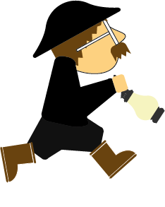

# Source files

## Main class

* **[plpViewController.m](plpViewController.m)** deals with user interaction when the App is launched: New Game / Credits / Resume, as well as “pause” and “repeat level” in-game buttons

* **[plpMyScene.m](plpMyScene.m)** renders the scene and deals with touch actions while the game runs

## Objects

* **[plpHero.m](plpHero.m)**: class for our main character Edgar

* **[plpEnemy.m](plpEnemy.m)**: these nasty aliens make Edgar lose control of himself

* **[plpItem.m](plpItem.m)**: pickup items (uranium cells and boni)

* **[plpPlatforms.m](plpPlatforms.m)**: horizontal and vertical moving platforms

* **[plpTrain.m](plpTrain.m)**: little trains (actually minecarts)

## Tilemap parser

**[JSTileMap.m](JSTileMap.m)** loads .tmx tilemaps. We make them using GPL editor [Tiled](http://www.mapeditor.org).

MIT-licensed code by Jeremy Stone and Christopher LaPollo -- GitHub repo: https://github.com/slycrel/JSTileMap