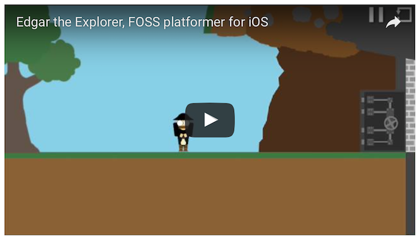

# Edgar

Open-Source iOS game “Edgar The Explorer”.

Images under **CC-BY** license, source under **LGPL** licence. Sounds: mixed license (see COPYING).

We started this project during **summer 2014**.

On **June 4, 2016**, Apple authorized the external testing [using TestFlight](https://developer.apple.com/testflight/). We got a lot of great feedback and this enabled us to improve the game a lot.

As of **August 13, 2016**, the App, [App Preview](https://developer.apple.com/app-store/app-previews/) and screenshots are almost ready. We still need to fix [some issues](issues).

All source files are in **[Maze Escape](Maze%20Escape)**. This folder's [README](Maze%20Escape/README.md) contains more informations about the code.

Three great, much more advanced FOSS iPhone games we love:

* 2048 (MIT) https://github.com/gabrielecirulli/2048

* Dungeon Story (MIT) https://github.com/pdeligia/dungeonstory-ios

* Puzzles (MIT) https://github.com/ghewgill/puzzles

We are looking for other free/libre iOS games or game makers. Any help is appreciated.

Best

Filipe & Paul
